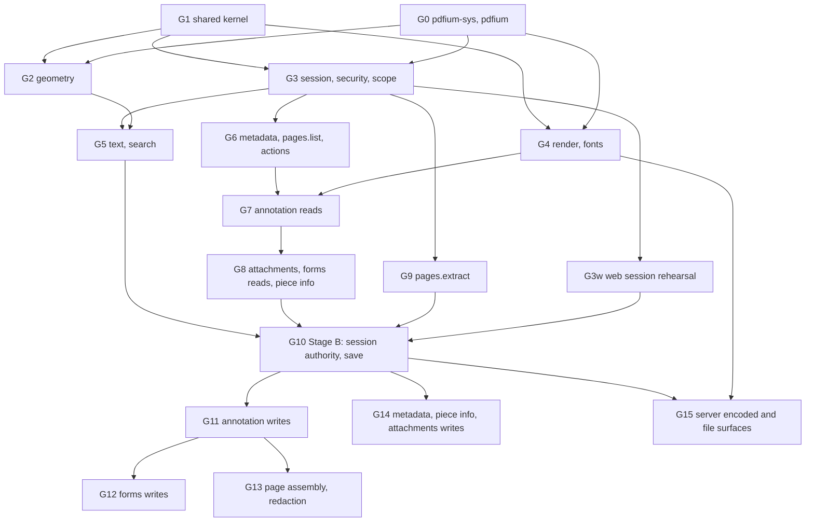

# TypeScript to Rust port order

Line counts were rechecked on non-test `.ts` files at the review commit. They
measure source coverage, not Rust effort; groups overlap where a helper serves
more than one operation. `core/` and `services/` paths below are relative to
`packages/engine/`; other shortened paths are relative to the feature directory
named in that row. Planned Rust crates and test harnesses do not exist at the
repository root yet. Operation names are `WorkerRequest` kinds from
`packages/engine/core/src/wire/worker-protocol.ts`. Suite names are files in
`packages/engine/core/src/conformance/`.

## 1. Grouping rules

1. A group is a set of modules that share one resource owner and one conformance
   gate. It lands as one PR series and flips as one routing entry.
2. Reads before writes. Stage A (TypeScript owns the session) covers G2 and G4
   through G9. G3 is a native-only owner in Stage A; on web it appears only as
   the G3w rehearsal. Stage B (G10) moves session authority. Stage C covers G11
   onward.
3. Dependencies point from prerequisites to dependents, and the edges are
   host-conditional. The graph in Section 5 is the web ordering. On native every
   read group also depends on G3, because a Rust-owned session is the only way
   to open a document there: G2 is Phase 0 on web and cannot start before G3 on
   native.
4. Filed by behavior, not by name prefix. `forms.list` and `forms.export` are
   reads (G8). `pages.extract` is a read (G9). `pages.renderEncoded` is a server
   surface (G15).
5. Native hosts get every group through a Rust-owned session from G3 onward. Web
   reaches G2 and G4 through G9 through the Stage A borrowed-handle bridge, and
   reaches a Rust-owned session only at G3w and then G10.
6. A group whose behavior reaches the web viewer also carries a viewer flow from
   Section 7. The conformance suite is the engine oracle. The flow is the SDK
   oracle, and it fails on things the suite cannot see.

## 2. Source inventory

| Package                        | Lines                                  | Ports                                                                                                                                                                                                                                                                                                                                                                                                                   | Stays TypeScript                                                                                                                                                                                                                                                                                                                                                                                                                                                                                                                                  | Deleted                                                                                                                                                                                                                                       |
| ------------------------------ | -------------------------------------- | ----------------------------------------------------------------------------------------------------------------------------------------------------------------------------------------------------------------------------------------------------------------------------------------------------------------------------------------------------------------------------------------------------------------------- | ------------------------------------------------------------------------------------------------------------------------------------------------------------------------------------------------------------------------------------------------------------------------------------------------------------------------------------------------------------------------------------------------------------------------------------------------------------------------------------------------------------------------------------------------- | --------------------------------------------------------------------------------------------------------------------------------------------------------------------------------------------------------------------------------------------- |
| `packages/engine/services/src` | 16,620                                 | `document-session/` (832), `features/` (13,790), `shared/` (151), `worker-host/WorkerHost.ts:1380-1414` (`finishMutation`, `saveLayerArtifact`, 35 lines); session/dispatch behavior needs an explicit split as well                                                                                                                                                                                                    | `worker-host/WorkerHost.ts` message loop and transport (~1,420 of 1,459); `events/EventHub.ts` (99, adapter delivery used only by `engine/main`); service barrels (72) and runtime index (24) need export updates                                                                                                                                                                                                                                                                                                                                 | `runtime/memory/` (193): replaced by `bindgen` structs in Rust; retained for the TypeScript server and rollback backends through Phase 5. Final removal in Phase 6 only after server migration passes and the TypeScript fallback is retired. |
| `packages/engine/core/src`     | 25,683 (18,562 outside `conformance/`) | 8,811 lines of candidate types/behavior: `text/` (762), `search/` (655), `dto/` (1,636), `errors/` (150), `identity/` (215), `revision/` (64), `mutation/` (635), `geometry/` (300), `annotation/` engine behavior (2,514: 997 top-level plus 1,517 in `kinds/`), `forms/` (797), `auth/scope/` (904, deliberate duplicate), `events/DocumentEvent.ts` (179). Mechanical updates: `annotation/kinds/**/index.ts` (695). | Handwritten annotation schemas (`base.schema.ts` plus `kinds/*/schema.ts`, 1,070), with bidirectional parity tests against generated types and Rust serialization; `wire/` (4,586, including the worker protocol whose types need generation/adapters), `engine/` interfaces (1,487), `promise/` (172), `resource/` (189), `annotation/relationships.ts` (147), `annotation/comments.ts` (297), `conformance/` (7,121); 1,087 root-barrel lines need mechanical export updates; `events/DocumentEventStream.ts` (21) stays a TypeScript interface | none                                                                                                                                                                                                                                          |
| `packages/engine/main/src`     | 5,568                                  | none                                                                                                                                                                                                                                                                                                                                                                                                                    | all (`LocalEngine`, `Local*Service`, transport, worker bootstrap, web capability guard)                                                                                                                                                                                                                                                                                                                                                                                                                                                           | none                                                                                                                                                                                                                                          |
| `packages/engine/runtime`      | n/a                                    | none                                                                                                                                                                                                                                                                                                                                                                                                                    | thin WASM loader                                                                                                                                                                                                                                                                                                                                                                                                                                                                                                                                  | `PdfFunctions`, `PdfRuntimeMemory` generated peek/poke layer, retained through Phase 5; final removal in Phase 6 only after server migration passes and the TypeScript fallback is retired                                                    |

The 8,811-line core candidate inventory includes handwritten validation modules,
such as `forms/schema.ts`, `geometry/schemas.ts` and `dto/PdfAction.schema.ts`.
Port their validation semantics, retain their exported Zod APIs, and add parity
tests. Likewise, the shared annotation kind files combine DTOs and schemas; a
directory-level count is not a deletion instruction.

## 3. Groups

### G0. Foundation (no TypeScript source)

**Rust:** `crates/build-support`, `crates/pdfium-sys`, `crates/pdfium`

**Replaces:**
`packages/engine/services/src/runtime/memory/{bits,scratch,strings,structs}.ts`;
`packages/engine/runtime/src/core/pdf-functions.generated.ts`;
`packages/engine/runtime/src/core/pdf-runtime-module.ts`

**Depends on:** Fork headers at the release pin

**Gate:** Builds against the fork’s `wasm32-eh` artifact using Rust target
`wasm32-unknown-emscripten`, plus `aarch64-apple-ios`, `aarch64-apple-ios-sim`,
`aarch64-linux-android`, `x86_64-linux-android`, host. Unsafe audit recorded.

**Phase:** 0 host/WASM foundation; 1 mobile distribution builds

**Notes:** "Replaces" is not "deletes in Phase 0". Stage A keeps TypeScript as
the session owner and reaches PDFium through the generated function table
(`PagePtrPool.ts:36`), and 102 of 145 service files import
`@embedpdf/engine-runtime` at the start of the port. The TypeScript memory layer
stays live and maintained through Phase 5 for the server and rollback backends.
Flipping the last Stage C family ends its use on the Rust path; final deletion
in Phase 6 requires passing the server migration and retiring the TypeScript
fallback.

### G1. Shared kernel (pure, no PDFium)

**TypeScript:** `core/src/errors/{EngineError,EngineErrorCode}.ts`;
`core/src/dto/*` (as `ts-rs` sources); `core/src/identity/*`;
`core/src/revision/*`; `core/src/geometry/{primitives,convert}.ts`;
`core/src/mutation/{MutationMeta,RefetchReason,PageStructureCache}.ts`;
`services/src/shared/{pdf-date,uuid,securityPermissions,abort}.ts`

**Rust:**
`epdf-engine::{error, dto, identity, revision, geom, clock, ids, cancel}`

**Depends on:** nothing

**Gate:** `ts-rs` output for each migrated DTO checked in; CI fails on dirty
diff; `MetadataPatch` serialization/validation vectors on each host in Phase 0,
with full `metadata.update` operation parity in G14; `EngineErrorCode` values
byte-identical to `EngineErrorCode.ts`; schema parity harness covers handwritten
wire and annotation schemas, extended with each DTO family in G7/G11

**Phase:** 0

**Notes:** `abort.ts` becomes a cancellation token, not an `AbortSignal`.
`uuid.ts` and `Date.now()` become injected sources for corpus determinism.

Every Stage A reader is written against `DocumentAccess` / `PageAccess`, the
generalization of the `FormModelView` borrowed/owned access pattern in
`multiplatform-port-hazards.md` 3.4. Stage A supplies the borrowed
implementation over a validated pointer; Stage B supplies the owned one over
scoped session access, with fallible cache preparation before borrowing. Without
this the read groups are written once against a borrowed raw pointer and again
at G10 against a session, and that second pass is in nobody's estimate. The cost
is that the trait is designed before the Stage B session exists, so validate its
shape in the Phase 0 Stage B spike and revise it as required; do not assume one
revision will suffice.

### G2. Page geometry

**TypeScript:** `services/src/features/geometry/PageGeometryReader.ts` (333);
`core/src/dto/PageGeometrySnapshot.ts` (127)

**Operations:** `pages.geometry`

**Depends on:** G0, G1

**Stage:** A on web

**Gate:** `runPageGeometryOrientationConformance` (a property suite: round-trip,
`charStart` tiling, orientation, quad parallelism, bounds containment; a
wrong-but-self-consistent reader passes it); a glyph-level differential harness
against `PageGeometryReader`, built in Phase 0 because none exists; no per-glyph
host call; corpus geometry case; viewer flows F3 and F4. Speed gate: no
regression against the Phase 0 recorded baseline, plus an absolute latency
ceiling in milliseconds set in Phase 0 from that baseline. The committed 2.6x is
a per-item-vs-coarse ratio from a different arm and is not the threshold.

**Phase:** 0

### G3. Session core and security

**TypeScript:** `services/src/document-session/DocumentSession.ts` (354);
`pages/{PagePtrPool,PageRecord}.ts` (90); `revisions/RevisionAuthority.ts`
(103); `lifecycle/{PdfDocumentOpener,BaseDocumentRegistry}.ts` (285);
`services/src/features/security/{SecurityReader,internal/buildSecurityInfo}.ts`
(217); `core/src/engine/document-security-state.ts` (115);
`core/src/auth/scope/*` (904); `core/src/dto/OpenInput.ts` (171);
`core/src/dto/LayerScopes.ts` (42)

**Operations:** `open.fatMem`, `open.layerMemBase`, `open.layerFileBase`,
`document.checkPasswordPermissions`, `document.probeSecurityFile`; control
frames `close`, `layer.close`, `abort`, `shutdown`

**Depends on:** G0, G1

**Stage:** Native-only owner until G3w. On web the TypeScript session stays
authoritative for every read group; the Rust session reaches web first through
G3w, then takes authority at G10.

**Gate:** Open, wrong password, permission, close, cancel traces; owner-thread
confinement test; balanced acquire/release; close rejects new work and waits for
outstanding leases and finalization; `auth/scope` shared vectors agree with the
TypeScript resolver

**Phase:** 1 (minimal subset for smoke apps), 2 (hardened)

**Notes:** `auth/scope` is a deliberate duplicate: web retains the resolver in
`engine/core` and its enforcement callers in `engine/main`; no deletion at Stage
C is implied. Native permission enforcement has no other owner.

### G3w. Web session rehearsal (opt-in)

**TypeScript:** No new feature code. A backend-selection entry at open in
`services/src/document-session/lifecycle/PdfDocumentOpener.ts` and the
`WorkerHost` open path.

**Operations:** The G3 set through an internal rehearsal flag: `open.fatMem`,
`open.layerMemBase`, `open.layerFileBase`, `document.checkPasswordPermissions`,
`document.probeSecurityFile`, `close`, `layer.close`. No read operation routes
to the Rust session.

**Depends on:** G3 green on native

**Stage:** A. The one exception to Stage A's "TypeScript owns the session" rule,
scoped to documents opened with the flag set.

**Gate:** The G3 gate re-run under the browser worker and the Node worker: open,
wrong password, permission, close, cancel traces; balanced acquire/release;
close rejects new work and waits for outstanding leases and finalization. Plus a
document opened on the Rust session and closed without a single read, under the
real transport, with no leak reported by the soak run. Cover the transport
portion of F9; the viewer’s normal initialization reads require G10.

**Phase:** 3

**Notes:** This exists so that Stage B is not the first time a Rust-owned
session runs on web. It routes no reads, so it adds no row to the operation
matrix in Section 6: every kind it touches is already owned by G3. It stops
being separate once G10 lands. The public Rust routing profile still uses
TypeScript session ownership during Stage A; the internal rehearsal flag must
not silently change that profile’s behavior.

### G4. Render and fonts

**TypeScript:**
`services/src/features/render/{PageRenderReader,deviceRaster}.ts` (294);
`services/src/features/fonts/FontRegistrar.ts` (187);
`core/src/dto/{PageRender,FontSpec}.ts` (194)

**Operations:** `pages.render`; `fonts.register`, `fonts.addFallback`,
`fonts.clearFallbacks`, `fonts.clear`. Also an internal `render_page_bitmap`
entry point, not a wire kind, which G15 consumes for its encoded-render wire
operation.

**Depends on:** G0/G1 on web; G3 additionally on native. Fonts are engine-level,
registered before first render and independent of a document session.

**Stage:** A on web for rendering; engine-level font ownership moves as one unit
in G4, independently of document backend selection

**Gate:** Exact interior colors on the existing colored fixture: BGRA internally
where used, and RGBA with the existing alpha contract at the public web
boundary; loose whole-page gate; tile, rotation, alpha and buffer-lifetime
tests; font-before-first-job test; coexistence test registering once, rendering
through both backends and authoring FreeText through the retained TypeScript
writer; clear/re-register and fallback-order tests across both paths;
worker-recreation rollback test; pixel path measured in parts (WASM-to-host
copy, worker transfer, channel conversion, GPU upload); viewer flows F1 and F2

**Phase:** 1 (smoke), 2

**Notes:** The committed arms establish no material rasterization benefit here.
Reason to move: native needs it and the pixel path needs one owner. Encode stays
a host-injected concern. `FontRegistrar` is engine-level (constructor takes
`runtime` and a `fontKey → FontId` map, no session) and retains file-access
handles until `clear` (`FontRegistrar.ts:51`). G4 transfers the key-to-ID map,
registration, fallback order and retained handles together to one Rust
`FontRegistry` per combined worker before startup fonts or documents are loaded.
`FontRegistrar` becomes a delegating facade, including `idFor`, with no second
map. Native uses the Rust owner from its first render; the unmigrated server
keeps its TypeScript owner until Phase 5. See the governing plan Section 6 for
worker-level rollback.

### G5. Text and search

**TypeScript:** `services/src/features/text/PageTextReader.ts` (136);
`core/src/text/{charmap,layout}.ts` (762);
`core/src/search/{types,fold,literal,matcher,regex,rects,snippet,epoch}.ts`
(655);
`services/src/features/search/{SearchReader,internal/searchCursor,internal/pageCorpusCache}.ts`
(325); `core/src/dto/PageTextSnapshot.ts` (35)

**Operations:** `pages.text`, `search.query`

**Depends on:** G2 (search uses `PageGeometryReader` for rects), G3

**Stage:** A on web

**Entry gate:** Dialect vector file covering `regex.ts` accepted and rejected
syntax, `\d` `\w` `\b` under JavaScript `u` and `iu` modes (including K and ſ),
`\s`, Unicode properties, dot/line terminators, case folding, `^` `$` under `m`,
zero-length matches and cursor advance, fold map back to UTF-16 offsets,
generated from `RegExp` and `foldText`; execution/output budgets for adversarial
patterns, plus UTF-8-to-UTF-16 offset conversion and lone-surrogate handling.
Fixtures with non-empty `charMap` (non-BMP, non-printing), combining and RTL
text.

**Exit gate:** `runPageTextConformance`, `runTextDivergenceConformance`,
`runSearchConformance`; local cursor fields and query-key encoding cross-decode
under identical controlled state; restart search after reopen; viewer flows F4
and F5

**Phase:** 2

**Notes:** `text` is already coarse; gate on correctness, not speed. `layout.ts`
is also consumed by web selection plugins and stays in TypeScript there
(deliberate duplicate with shared vectors).

### G6. Document structure reads

**TypeScript:**
`services/src/features/metadata/{MetadataReader,internal/readCustomMetadata,internal/readMetadataText,internal/readTrappedStatus}.ts`
(151); `services/src/features/pages/PagesReader.ts` (214);
`services/src/features/actions/{ActionModelReader,DocumentActionsReader}.ts`
(522); `services/src/features/destinations/*` (130);
`core/src/dto/{DocumentMetadata,PageLayout,PageListSnapshot,PdfAction,PdfDestination,PdfLinkTarget,DocumentManifest}.ts`
(507)

**Operations:** `metadata.read`, `pages.list`, `actions.read`

**Depends on:** G3

**Stage:** A on web

**Gate:** `runMetadataConformance`, `runActionsConformance`; page identity
stable between lazy per-page lookup and full enumeration
(`DocumentSession.ts:41-44`, `recordsByIndex` / `recordsByObjectNumber` /
`fullyEnumerated`); viewer flow F6

**Phase:** 2

### G7. Annotation reads

**TypeScript:**
`services/src/features/annotations/{AnnotationReader,RawAnnotationReader,AnnotationAppearanceReader}.ts`
(368); `internal/read/*` (26 files, 1,922); `internal/identity/*` (96);
`internal/{annotationFlagBits,annotationIcon,annotationState,blendMode,colorType,freeTextIntent,inkIntent,lineEnding,replyType,shapeBorderStyle,stampName,standardFont,textAlignment,textEditIntent}.ts`
(~560);
`core/src/annotation/{subtype,primitives,base,registry,AnnotationListSnapshot}.ts`
(557); `core/src/annotation/kinds/*/dto.ts` (337, 19 files) and
`kinds/*.shared.ts` (437, 5 files); `core/src/dto/AnnotationRender.ts` (152);
`services/src/features/forms/internal/{formModelCache,readFormSnapshot}.ts`
(383), reached from
`services/src/features/annotations/internal/read/joinWidgetField.ts:23`

**Operations:** `annotations.listRawAll`, `annotations.listRawPage`,
`annotations.listFullPage`, `annotations.renderAppearances`

**Depends on:** G4 (appearance render), G6 (actions and destinations for link
annotations)

**Stage:** A on web. Rust does not create or retain the form model; TypeScript
lends the pointer.

**Gate:** `runAnnotationReadConformance`, `runAnnotationAppearanceConformance`;
repeated-read benchmark against today's cached form model; permission and
weak-annotation-state propagation back to the session owner; bidirectional
parity for handwritten annotation DTO schemas and generated types/Rust
serialization; viewer flow F7

**Phase:** 2

### G8. Files, forms reads, piece info

**TypeScript:** `services/src/features/attachments/AttachmentReader.ts` (128)
plus the read paths in `internal/attachmentPrimitives.ts` (274 total, the rest
shared with G14 writes);
`services/src/features/forms/{FormReader,internal/fieldFlagBits,internal/resolveFieldRef,internal/wideStringArray}.ts`
(188); `services/src/features/pieceinfo/PieceInfoAccessor.ts` `read` (lines
47-89) and `applications` (125-144) plus the shared object decoders (~150);
`core/src/forms/{field,snapshot,value,value-entry}.ts` (270);
`core/src/dto/{Attachment,PieceInfo}.ts` (121);
`core/src/identity/FormFieldRef.ts` (82)

**Operations:** `attachments.list`, `attachments.readFile`,
`annotations.readFile`, `pieceInfo.read`, `pieceInfo.applications`,
`forms.list`, `forms.export`

**Depends on:** G7

**Stage:** A on web

**Gate:** `runAttachmentConformance`, `runPieceInfoConformance`, read half of
`runFormConformance`; `annotations.readFile` byte equality with the TypeScript
path; viewer flow F8

**Phase:** 2

### G9. Page extract

**TypeScript:** `services/src/features/pages/PagesExtractor.ts` (92)

**Operations:** `pages.extract`

**Depends on:** G3

**Stage:** A on web. Scratch document is a transient closed before return.

**Gate:** `runPageExtractConformance`; reopen extracted bytes and compare page
count and sizes

**Phase:** 2, last read slice

**Notes:** Calls `FPDF_CreateNewDocument`, `FPDF_ImportPagesByIndex`,
`EPDF_SaveDocumentToOwnedBuffer`, `FPDF_CloseDocument` directly
(`PagesExtractor.ts:56-89`); does not use `DocumentSaver`. The Rust wrapper for
`EPDF_SaveDocumentToOwnedBuffer` lands here and `DocumentSaver.saveStandalone*`
reuses it in G10.

### G10. Session authority and save (Stage B)

**TypeScript:** Rust-owned save and session integration land here.
`DocumentSession.ts` becomes a facade for Rust-profile sessions;
`WorkerHost.finishMutation` and `saveLayerArtifact` (`WorkerHost.ts:1380-1414`,
~35 lines) and `BaseDocumentRegistry` move to Rust;
`services/src/events/EventHub.ts` stays TypeScript (the `EventHub` class is
constructed only in `engine/main/src/document/LocalDocumentHandle.ts:84`, but
the `SessionEventPublisher` it exports is threaded through 8 files under
`engine/main/src/document/`) while Rust finalization supplies ordered events and
an acknowledged stream delivers them independently of a cancelled request;
`DocumentSaver.ts` (137) and `internal/pdfSaveMode.ts` (18);
`core/src/events/DocumentEvent.ts` (179); `core/src/dto/PdfSaveMode.ts`

**Operations:** `document.saveBuffer`, `document.saveFile`,
`document.saveLayerBuffer`

**Depends on:** G4 through G9 green on web; G3 green on native; G3w green on web

**Stage:** B

**Gate:** Revision, page lease, retained-source, password-state and close tests;
`runDocumentEventsConformance`; save, `document.download()`, reopen, semantic
readback scenarios seeded from piece-info and page-insert round trips; the Phase
0 bridge spike promoted to a permanent test; exactly-once live-session
publication despite a discarded late response, with event deduplication and
resync after worker failure

**Phase:** 4, first

**Notes:** Use save/reopen semantic comparison here; the reviewed conformance
suites do not establish byte-stable PDF serialization.

### G11. Annotation writes

**TypeScript:** `services/src/features/annotations/AnnotationMutator.ts` (784);
`internal/write/*` (22 files, 3,496);
`internal/mutations/computeMutationImpact.ts` (141);
`core/src/annotation/{appearance,normalize,patch-base,draft-base}.ts` (440);
`core/src/annotation/kinds/*/{patch,draft,normalize}.ts` (743: patch 257 over 19
files, draft 380 over 19, normalize 106 over 2);
`core/src/mutation/{AnnotationListMutationMeta,AnnotationMutationImpactPolicy,AnnotationMutationResults}.ts`
(152)

**Operations:** `annotations.create`, `annotations.update`,
`annotations.delete`, `annotations.move`

**Depends on:** G10

**Stage:** C

**Gate:** `runAnnotationMutationConformance` (2,431 lines); appearance and event
suites; partial failure, cancellation-after-apply, save and reopen traces;
review rule that no `?` past the apply boundary introduces a throw path; extend
annotation schema parity to draft and patch types, including absent/null/value,
fields that disallow null, explicit JavaScript undefined, and rejection
behavior; viewer flows F10 and F14

**Phase:** 4

### G12. Forms writes

**TypeScript:**
`services/src/features/forms/{FormMutator,FormsEffectsApplier,internal/authorWidget}.ts`
(1,120); `core/src/forms/{draft,patch,effects,submission,schema}.ts` (527; the
Zod schema stays TypeScript, with Rust validation parity);
`core/src/mutation/FormMutationResults.ts` (91)

**Operations:** `forms.setValue`, `forms.reset`, `forms.applyEffects`,
`forms.import`, `forms.repair`, `forms.createField`, `forms.updateField`,
`forms.deleteField`, `forms.attachWidget`, `forms.detachWidget`

**Depends on:** G11 (widget annotations)

**Stage:** C

**Gate:** Write half of `runFormConformance`; handwritten form-schema parity
against generated types and Rust validation; persisted-output readback; viewer
flow F11; form-JavaScript support tracked as a capability (web keeps
`packages/core/js-sandbox`; mobile reports unsupported)

**Phase:** 4

### G13. Page assembly and redaction

**TypeScript:**
`services/src/features/pages/{PagesMutator,PagesInserter,PagesFlattener}.ts`
(552); `services/src/features/redaction/RedactionApplier.ts` (274);
`core/src/mutation/{PageDeleteInput,PageDeleteResult,PageFlattenResult,PageInsertBlankInput,PageInsertResult,PageMoveInput,PageMoveResult,PageRotateInput,PageRotateResult,RedactionApplyResult}.ts`
(244)

**Operations:** `pages.rotate`, `pages.move`, `pages.delete`,
`pages.insertBlank`, `pages.insert`, `pages.flatten`, `redaction.apply`

**Depends on:** G11 (flatten and redaction re-read annotations after apply)

**Stage:** C

**Gate:** `runPageRotateConformance`, `runPageReorderConformance`,
`runPageDeleteConformance`, `runPageInsertBlankConformance`,
`runPageInsertConformance`, `runPageFlattenConformance`,
`runRedactionApplyConformance`; page identity across reorder within the same
live document; after save/reopen compare page order/content, not unreconciled
document-scoped handles; source retention for `pages.insert` on one owner
(`PagesInserter.ts:77` `session.retainUntilClose`); viewer flows F12 and F13

**Phase:** 4

### G14. Remaining mutators

**TypeScript:**
`services/src/features/metadata/{MetadataMutator,internal/write/*}.ts` (193);
`services/src/features/pieceinfo/PieceInfoAccessor.ts` `update` (lines 91-124)
and `clear` (146-end); `services/src/features/attachments/AttachmentMutator.ts`
(120) and write half of `attachmentPrimitives.ts`;
`core/src/mutation/{MetadataUpdateResult,AttachmentMutationResults}.ts` (72);
`core/src/dto/MetadataPatch.ts` (already ported in G1)

**Operations:** `metadata.update`, `pieceInfo.update`, `pieceInfo.clear`,
`attachments.create`, `attachments.delete`

**Depends on:** G10

**Stage:** C

**Gate:** Metadata, piece-info and attachment suites; three-state patch
semantics on each host

**Phase:** 4

### G15. Server and file surfaces

**TypeScript:** Host adapters in `WorkerHost.ts` for encoder injection and file
sinks; no new Rust behavior beyond G4 raster and G10 save

**Operations:** `pages.renderEncoded` (sole owner of the wire kind; the raster
step comes from G4's internal entry point),
`annotations.renderAppearancesEncoded`, `document.renderPageFile`,
`document.renderPageFileEncoded`

**Depends on:** G4, G10

**Stage:** C

**Gate:** Browser and local workers still return `NotImplemented` for encoded
kinds (`worker-protocol.ts:446`); server output equivalence

**Phase:** 5 (server milestone)

## 4. Not ported

| Module                                                                                                  | Disposition                                                                                                                          | Reason                                                                                                                                                                                                                                                                                                                                                                                            |
| ------------------------------------------------------------------------------------------------------- | ------------------------------------------------------------------------------------------------------------------------------------ | ------------------------------------------------------------------------------------------------------------------------------------------------------------------------------------------------------------------------------------------------------------------------------------------------------------------------------------------------------------------------------------------------- |
| `services/src/worker-host/WorkerHost.ts` message loop, 64 `case` arms, transport                        | Stays TypeScript on web; native has its own scheduler/FFI dispatch                                                                   | Transport is not engine behavior. `finishMutation` is, and ports in G10.                                                                                                                                                                                                                                                                                                                          |
| `services/src/runtime/memory/*`                                                                         | Retained through Phase 5; final removal in Phase 6 after server migration passes and the TypeScript fallback is retired              | Peek/poke over WASM linear memory. `bindgen` structs replace it in Rust, but Stage A runs on it: TypeScript owns the session through G10, and every service that has not yet flipped reaches PDFium through it. The TypeScript fallback and `cloudpdf/server/src/runtime/worker-entry.ts`, which constructs the runtime and shared `WorkerHost`, still need it after the final Rust family flips. |
| `packages/engine/runtime` generated `PdfFunctions`, `PdfRuntimeMemory`                                  | Retained through Phase 5; final removal in Phase 6 after server migration passes and the TypeScript fallback is retired; loader kept | Same.                                                                                                                                                                                                                                                                                                                                                                                             |
| `packages/engine/main/src/*`                                                                            | Stays TypeScript                                                                                                                     | Orchestration, transport, `LocalEngine`. Web capability guard (`LocalPageTextService.ts:48`) stays here; native enforcement is G3.                                                                                                                                                                                                                                                                |
| `core/src/wire/*` (schemas, paths, resources, tokens, cdn, `WirePack`, `flatten`, `renderOptionsCodec`) | Stays TypeScript                                                                                                                     | Cloud HTTP contract. `worker-protocol.ts` operation DTOs become generated/adapted from Rust; host envelopes and transport/control frames remain TypeScript-owned.                                                                                                                                                                                                                                 |
| `core/src/engine/*` interfaces                                                                          | Stays TypeScript                                                                                                                     | Web public API. Swift and Kotlin facades are handwritten equivalents, not translations.                                                                                                                                                                                                                                                                                                           |
| `core/src/promise/*`                                                                                    | Stays TypeScript                                                                                                                     | Cancellation of waiting is a host concern. Rust has a token.                                                                                                                                                                                                                                                                                                                                      |
| `core/src/resource/*`                                                                                   | Stays TypeScript                                                                                                                     | `BinarySource` is host I/O.                                                                                                                                                                                                                                                                                                                                                                       |
| `core/src/annotation/{relationships,comments}.ts`                                                       | Stays TypeScript; facades may reimplement                                                                                            | Consumer-side composition over flat edges. Engine surfaces the edges.                                                                                                                                                                                                                                                                                                                             |
| `core/src/conformance/*`                                                                                | Stays TypeScript; emitted into the corpus                                                                                            | Suites are the oracle.                                                                                                                                                                                                                                                                                                                                                                            |
| `packages/core/*`, `packages/plugin/*`, `packages/framework/*`, `packages/viewer/*`                     | Stays TypeScript                                                                                                                     | Out of scope. Presentation is rewritten natively in Phase 3, not ported.                                                                                                                                                                                                                                                                                                                          |

## 5. Dependency graph

## 6. Operation coverage check

The `WorkerRequest` union (`worker-protocol.ts:866`) has 63 members.
`OpenWorkerRequest` is a union alias expanding to three `open.*` kinds, so there
are 65 distinct request kinds. Four are control frames (`abort`, `close`,
`layer.close`, `shutdown`), all in G3, leaving 61 non-control operations,
including engine-wide font operations. Every one appears in exactly one group
above. G3w routes a subset of G3's kinds to a second backend and adds no row.

Do not use 64: that is the `case` arm count in `WorkerHost.ts`, which is 65
minus `abort` because `abort` is handled before the switch
(`WorkerHost.ts:199`).

The response/lifecycle kinds are `resolve`, `reject`, `ready` and `init-error`;
their transport envelopes stay TypeScript-owned. `fresh`, `raw-delta`,
`artifact` and `artifact-file` are the four `LayerOpenSource` input variants
nested inside open requests, not independent messages. Rust needs equivalent
layer-open semantics and adapters in G3. CI should fail when a kind is added to
`worker-protocol.ts` without a row in the operation matrix this document seeds.

## 7. Web viewer end-to-end gate

No automated viewer end-to-end harness exists in the reviewed repository. No
project declares a Playwright dependency or suite (the lockfile only mentions
optional peers), the five `vitest.config.ts` files under `packages/` all set
`environment: 'node'`, and the explicit DOM-environment overrides are four files
under `packages/framework/react/test/` using `// @vitest-environment happy-dom`.
Section 4 puts `packages/plugin/*`, `packages/framework/*` and
`packages/viewer/*` out of scope for the port, which is correct and is also why
they need a gate: they are the code most likely to break silently while nothing
in them changes.

The harness lives in `tooling/viewer-e2e/`, drives `examples/viewer-react`, and
selects the backend at open so each enabled flow runs against both routing
profiles in one job. During Stage A the Rust profile still has a TypeScript
session owner; G3w is a separate transport-only rehearsal. From Stage B the Rust
profile uses a Rust-owned session. Flows assert DOM state, copied text and
published events. The rendered page canvas may be compared with the pixel gate's
mean and max tolerances; nothing is compared by hash, and full-page screenshots
are not gates.

| Flow                            | Asserts                                                                                                                                                                         | Groups | Phase                                                      |
| ------------------------------- | ------------------------------------------------------------------------------------------------------------------------------------------------------------------------------- | ------ | ---------------------------------------------------------- |
| F1 open and first paint         | Document opens from a fixture, page 1 paints, the page count in the UI matches the file                                                                                         | G4     | 0 baseline, 2 on Rust                                      |
| F2 scroll and virtualization    | Scroll to a late page, every visible tile resolves, no unresolved tile after the view settles, no re-request of a tile already held                                             | G4     | 0 baseline, 2 on Rust                                      |
| F3 zoom                         | Zoom in and out through the gesture path, page geometry stays consistent, no missing tiles at the new scale                                                                     | G2, G4 | 0 baseline, 2 on Rust                                      |
| F4 selection and copy           | Drag-select across a line and across a page boundary, the clipboard text equals the frozen vector's string                                                                      | G2, G5 | 0 baseline, 2 on Rust                                      |
| F5 search navigation            | Query returns the expected match count, next and previous scroll to and highlight each match                                                                                    | G5     | 0 baseline, 2 on Rust                                      |
| F6 links and actions            | An internal link lands the viewport on the target page; an external link resolves to the expected URL without navigating                                                        | G6     | 2                                                          |
| F7 annotation display           | Existing annotations paint at the expected positions, selection and hover UI activates on the right one                                                                         | G7     | 2                                                          |
| F8 form display                 | Field values, checkbox and listbox state match the file                                                                                                                         | G8     | 2                                                          |
| F9 open failure path            | Wrong password surfaces the expected password/security state (and `EngineErrorCode` on rejection), without matching message text; cancel during open leaves no partial document | G3w    | 2 on TypeScript, 3 Rust transport test, 4 full Rust viewer |
| F10 annotation write round trip | Create, edit and delete through the UI, save, reopen the saved bytes in a fresh viewer instance, the result matches                                                             | G11    | 4                                                          |
| F11 form fill round trip        | Fill fields through the UI, save, reopen, values persist                                                                                                                        | G12    | 4                                                          |
| F12 page assembly round trip    | Rotate, delete and reorder through the UI, save, reopen, page order and content hold; verify stable page identity separately before closing                                     | G13    | 4                                                          |
| F13 redaction round trip        | Apply a redaction through the UI, save, reopen, the text is gone from the extracted text                                                                                        | G13    | 4                                                          |
| F14 undo and redo               | After a mutation, undo restores the pre-mutation state and redo restores the post-mutation state in both document and UI                                                        | G11    | 4                                                          |

F1 through F5 are written against the shipping TypeScript backend in Phase 0.
That ordering is the point: a suite delivered alongside the port cannot tell a
regression from a bug it never covered.

The cost: this is the most expensive test surface in the plan per assertion, and
the usual home of flake. Synchronize with engine events and observable UI state;
use bounded deadlines to fail stalled tests instead of arbitrary sleeps.
Chromium and Firefox run per pull request, WebKit on the scheduled job. A
quarantined flow needs an open issue and expires in one release, or the gate
decays into a suite nobody trusts.
